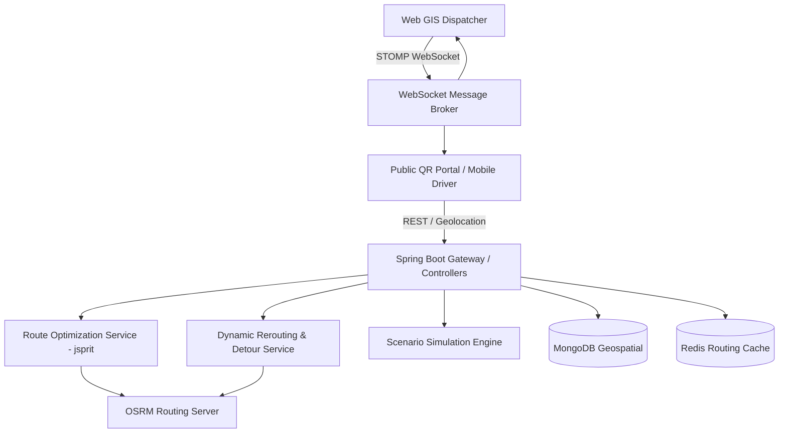

# 🚛 Urban Fleet VRP Solver & Intelligent Waste Logistics Backend

[](https://www.oracle.com/java/)
[](https://spring.io/projects/spring-boot)
[](https://www.mongodb.com/)
[](https://redis.io/)
[](https://spring.io/guides/gs/messaging-stomp-websocket/)
[](http://project-osrm.org/)

An enterprise-grade, real-time backend engine engineered for municipal fleet management, smart waste collection, dynamic incident rerouting, and multi-vehicle route optimization (CVRPTW).

---

## 🌟 Key Capabilities & Architectural Pillars

### 1. 🧠 Combinatorial Optimization Engine (CVRPTW)
* **Formulation**: Capacitated Vehicle Routing Problem with Time Windows (CVRPTW) and intermediate disposal facilities.
* **Solver**: Custom metaheuristic optimization pipeline built on **`jsprit`** (Large Neighborhood Search / Ruin-and-Recreate).
* **Penalty-Augmented Objective**: Dynamic penalty matrix prioritizing critical overflow alerts (`+1,000` penalty cost) and sensor anomalies above routine collections.
* **Disposal Facilities**: Seamless multi-trip scheduling routing saturated trucks ($>80\%$ capacity) to intermediate landfills and eco-recycling centers before resuming route manifests.

### 2. 🚧 Geodesic Detour Synthesis & Dynamic Obstacle Avoidance
* **Incident Detection**: Identifies road blocks, floods, and construction zones blocking active vehicle trajectories.
* **Geodesic Waypoint Generation**: Multi-bearing projection algorithm calculating tangent avoidance points around the obstruction polygon.
* **OSRM Integration**: Computes real-world street network distance matrices and generates smooth detour paths without violating vehicle time windows.

### 3. 📡 Real-Time Telemetry & WebSocket Push
* **STOMP Channels**: Continuous pub/sub message brokering broadcasting live vehicle coordinates (`/topic/vehicle-locations`), newly filed incidents (`/topic/incidents`), and route updates (`/topic/routes`).
* **In-Cab Telemetry Feed**: Real-time sync for driver manifests, task compaction, and truck capacity fill metrics.

### 4. 📱 In-Cab Driver Companion API
* **Active Task Dispatch**: Provides turn-by-turn waypoint polylines, next bin destinations, fill levels, and compaction counters.
* **Voice Instruction Generator**: Generates concise, audio-friendly driving cues for Web Speech API integration.
* **One-Touch Actions**: Endpoints for bin collection completion, driver-reported road issues, and emergency dump requests.

### 5. 📣 Public Citizen Crowdsourcing & QR Geolocation Portal
* **Unauthenticated Endpoint**: Direct reporting portal for citizens scanning physical bin QR codes.
* **GPS & Category Triage**: Validates HTML5 geolocation against known municipal coordinates; classifies reports (`OVERFLOW`, `DAMAGED`, `ODOR_HAZARD`, `BLOCKED_ACCESS`) and automatically triggers priority dispatch when severe.

### 6. 🧪 Operational Scenario Simulation Sandbox
* **One-Click Stress Testing**: Sandbox controller injecting simulated real-world scenarios:
  * 🌅 *Morning Commute Rush*: High bin accumulation across residential hubs.
  * 🌊 *Flash Flood & Road Blocks*: Dynamic multi-street closures triggering real-time detours.
  * 🎪 *Market Festival Surge*: Saturated collection density in central business districts.
  * 🛠️ *Vehicle Breakdown*: Immediate mid-route failure with automatic fallback re-assignment.

---

## 🏛️ System Architecture



---

## 🚀 Quick Start & Installation

### Prerequisites
* **Java 17+ (JDK)**
* **Maven 3.8+**
* **MongoDB 6.0+**
* **OSRM Backend** (or public OSRM server)

### 1. Configuration
Configure your database and routing endpoints in `src/main/resources/application.properties`:

```properties
spring.data.mongodb.uri=mongodb://localhost:27017/garbage_collector
osrm.url=http://router.project-osrm.org
jwt.secret=9a4f2c8d7e1b5a3f6c8d0e2b4a6c8e1f3a5b7c9d1e3f5a7b9c1d3e5f7a9b1c3d
server.port=8080
```

### 2. Build & Run
```bash
# Clean and package
./mvnw clean package -DskipTests

# Run the Spring Boot application
./mvnw spring-boot:run
```

---

## 📡 REST API Reference

| Method | Endpoint | Description | Auth Required |
| :--- | :--- | :--- | :--- |
| `POST` | `/api/auth/login` | JWT Authentication & role verification | No |
| `GET` | `/api/bins` | Retrieve all municipal bins & fill levels | Yes |
| `POST` | `/api/routes/optimize/{deptId}` | Solve and trigger CVRPTW fleet dispatch | Yes |
| `POST` | `/api/routes/reroute/{deptId}` | Dynamic detour around active incidents | Yes |
| `GET` | `/api/driver/active-vehicles` | Fetch all vehicles and active route status | No |
| `GET` | `/api/driver/vehicle/{id}/task` | Driver cockpit manifest & turn-by-turn polyline | No |
| `POST` | `/api/driver/collect/{id}/{binId}` | Mark bin stop completed & update truck fill | No |
| `GET` | `/api/public/bins/{binId}` | Public QR code verification & bin metadata | No |
| `POST` | `/api/public/bins/report` | Submit citizen report with GPS & photo | No |
| `POST` | `/api/simulation/scenario/inject` | Trigger operational scenario in sandbox | No |
| `GET` | `/api/analytics/routes/history/{deptId}` | Historical routes with replay telemetry | Yes |

---

## 🛠️ Tech Stack & Dependencies
* **Core Framework**: Spring Boot 3.2.0 (Spring Web, Spring Security, Spring Data MongoDB, Spring WebSocket)
* **Optimization**: `jsprit-core`, `jsprit-analysis`
* **Geospatial & Geometry**: JTS Topology Suite, OSRM Polyline Decoders
* **Security**: JWT (JSON Web Tokens) with Role-Based Access Control (Admin / Department Manager / Driver)
* **Data Persistence**: MongoDB Geospatial 2dsphere Indexes, Redis 7